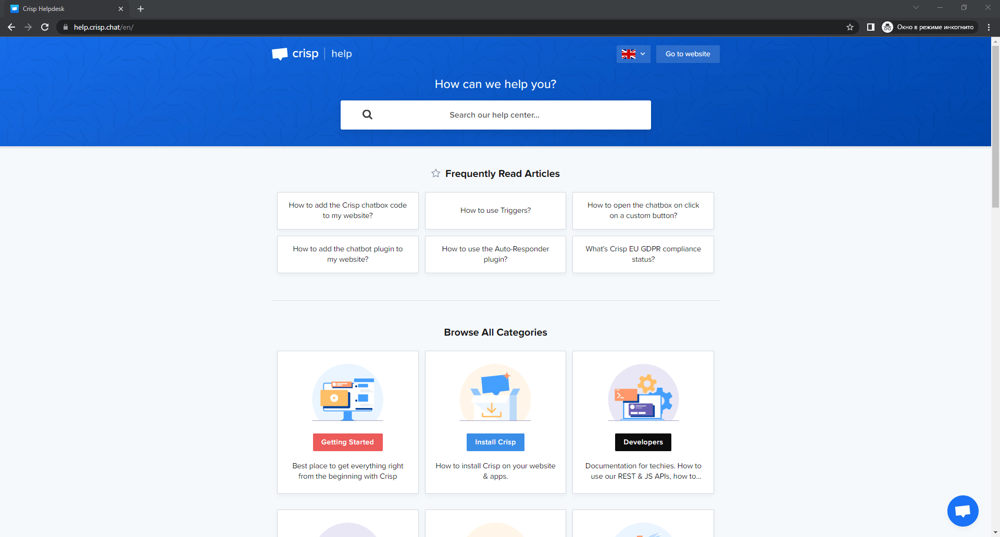

# 🧠 Platforms for Knowledge Base

**Knowledge base** - data space, that can be used both for developers and end users (_customers_) to share related information. Knowledge base is mostly used for keeping saved data during some period of time. ( _as i'm sharing info with you right here, e.g._ )

## **Crisp** ****

[Crisp ](https://crisp.chat/en/)is the most common and popular helpcenter. It's aimed at automating companies' technical support.

#### <mark style="color:green;">The most prevalent tools of Crisp:</mark>

 Livechat  

Livechat provides visitors of website to stay in touch with technical support. It also uses a unified inbox, which means, all messages coming from different sources (_Instagram,telegram, etc._) are saved in **Inbox.**&#x20;

To see how **Livechat** looks like, follow the picture below:arrow\_heading\_down:

********

 Knowledge Base 

Crisp demonstrates the great opportunity to create a knowdlege base. So, what does the knowledge base comprise?

* _<mark style="color:green;">Markdown</mark>_ <mark style="color:green;"></mark><mark style="color:green;">support</mark>, that gives you a chance to beautify the text for comfy readability for you and end users as well;
* _<mark style="color:green;">Multilangualism</mark>_. Add a new language and share your knowledge base for end users from other countries;
* _<mark style="color:green;">Import and Export</mark>_ articles. Create a back up by exporting articles. In case, there are any articles you want to use in your own knowledge base, you may import articles from other references.

Plugins 

How to automate technical support of your company with the help of **Crisp**?&#x20;

Plugins can help you out. There are plenty of plugins, however necessary for automation are:

* <mark style="color:green;">Auto-responder,</mark> that let you create prearranged patterns to employ them in responding on requests coming from your visitors of your website
* <mark style="color:green;">Chat bot</mark>, that  gives your visitors of your website to chat like they are chatting with a real person.&#x20;
* <mark style="color:green;">Triggers</mark>, used in automating some actions (_Show message, play sound and open chatbox_), that can be configured in different cases. For instance, when a visitor is going to leave a particular page, you may set one of the action mentioned above.

Analytics 

How to find out the most common problems of your products?

<mark style="color:green;">Analytics</mark> can be a good assistant to show the real statistics of requests from end users of your products.

To see how **Analytics** looks like, follow the picture below:arrow\_heading\_down:

.png>)


#### All the above-mentioned tools can be used by technical writers in terms of simplification the process of interaction between end users and technical support!


####
